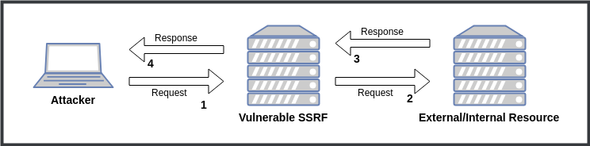
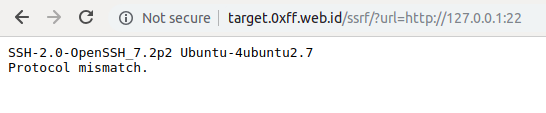
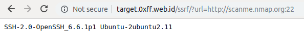
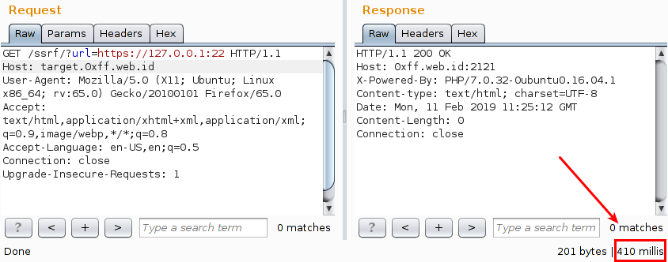
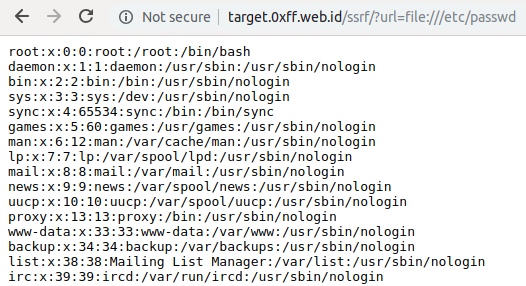
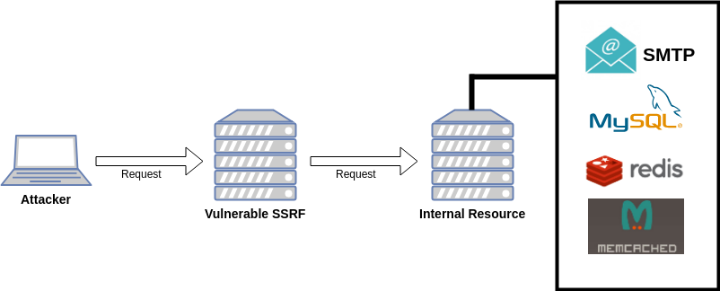
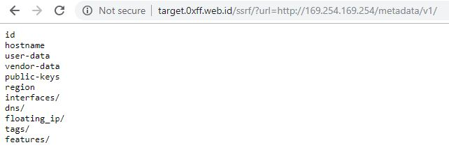
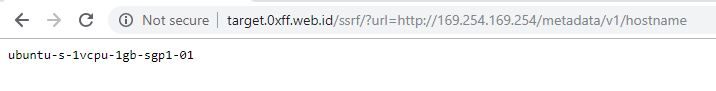
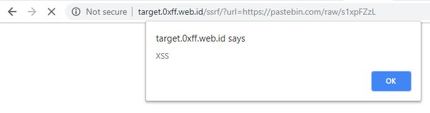

# Service Side Request Forgery

### Pengenalan SSRF

Service Side Request Forgery \(SSRF\) sederhana nya adalah serangan yang dimana server akan melakukan _request_ untuk si attacker baik itu ke local ataupun ke remote source lalu mengembalikan response yang berisi data hasil dari request tersebut, pengertian dari SSRF hanya sesimple itu.



Secara tidak langsung, konsep SSRF sama seperti penggunaan proxy atau VPN yang dimana user akan melakulan request ke resource tertentu, lalu server proxy atau VPN akan melakukan request ke resource tersebut, lalu mengembalikan hasil nya ke user yang melakukan request tadi.

Dari SSRF bisa dilakukan berbagai macam hal seperti :

* Melakukan Local/Remote Port Scan
* Membaca Local File \(menggunakan protokol file://\)
* Berinteraksi dengan aplikasi/service/jaringan internal
* RCE \(memanfaatkan berbagai macam aplikasi/service di jaringan intranet\)
* Membaca Metadata Cloud \(AWS, Azure, Google Cloud, Digital Ocean, dll\)
* Reflected XSS/CSRF

### Lab Setup

Untuk penggunaan lab pada tulisan ini hanya menggunakan script sederhana dibawah ini \(tentu saja ~~mungkin~~ aplikasi di Real World tidak sesederhana ini\) dan akan dideploy di Digital Ocean.

```php
<?php
    $url = $_GET['url'];

    $curl = curl_init();
    curl_setopt($curl, CURLOPT_URL, $url);
    curl_setopt($curl, CURLOPT_RETURNTRANSFER,1);
    curl_setopt($curl, CURLOPT_TIMEOUT, 5);
    curl_setopt($curl, CURLOPT_CONNECTTIMEOUT, 5);

    $data = curl_exec ($curl);

    if(curl_error($curl)){
        echo curl_error($curl);
    }else{
        echo "<pre>" . $data . "</pre>";
    }
    curl_close ($curl);
?>
```

Pemilihan `curl` sebagai _requestster_ karena memang `curl` support berbagai macam protokol.


_**requestster**_ adalah fungsi atau library yang digunakan untuk melakukan _fetch/request resource_ dari url yang di input.


### Local/Remote Port Scanning

Tujuan dari melakukan scanning port sederhananya agar bisa memetakan aplikasi/service yang berjalan, sehingga attacker bisa mengindentifikasi aplikasi/service apakah yang berjalan pada port tersebut. Hal ini menjadi sangat penting apabila attacker ingin berinteraksi lalu melakukan _querying_ ke aplikasi/service internal.

Scanning port bisa dilakukan dengan menggunakan protokol `http`,`https`, `gopher`, atau `dict`. 





Apabila _BLIND SSRF_ untuk mengetahui apakah port tersebut terbuka atau tertutup bisa dengan memperhatikan `Content-lenght` , `Response Time`,  atau `HTTP Status Code`.



Indikator untuk mengetahui tentu saja bukan dengan hanya ketiga element yang disebutkan diatas, bisa saja terdapat element "tak biasa" yang muncul saat percobaan scanning port karena itu bergantung pada teknologi apa dan _environment_ apa yang digunakan oleh aplikasi web tersebut.


Pada **HTTPS** apabila portnya terbuka response timenya akan lebih lama karena memang HTTPS akan melakukan _Handshake_, oleh karena itu penggunaan protokol HTTPS bisa menjadi pilihan yang cocok untuk melakukan scanning port apabila dihadapkan dengan BLIND SSRF


### Membaca Local File

Dalam konteks SSRF pengaksesan/pembacaan file lokal hanya bisa menggunakan protokol `file:///` akan tetapi tidak semua requestster support protokol `file:///` selain itu mungkin terdapat _hardfilter/blacklist_  yang tidak mengizinkan penggunaan protokol tersebut.

Untuk pengaksesan file nya sendiri bisa menggunakan `file:/PathToFile` , `file:///PathToFile` atau `file://hostname/PathToFile`. Ketiga cara pengaksesan tersebut merupakan _URI_ `file:///` yang valid.




Apabila aplikasi web dideploy di **Windows Server**, untuk mengakses file menggunakan protokol `file:///` bisa dengan `file:///<drive_letter/PathToFile`. Contoh : `file:///d:/hello.txt`


### Berinteraksi dengan aplikasi/service/jaringan internal



Kekuatan sebenarnya dari SSRF adalah ini, dimana attacker bisa berinteraksi dengan aplikasi/service/jaringan internal, bayangkan apabila terdapat aplikasi/service yang vulnerable dalam jaringan internal yang dimana attacker tidak bisa menjangkau aplikasi/service tersebut karena berada dijaringan yang berbeda, tapi dengan adanya celah SSRF akan menjadi solusi untuk permasalahan tersebut.

Apabila requestster nya mendukung penggunaan protokol `gopher://` atau mungkin terdapat celah `CRLF Injection` akan sangat memungkin attacker untuk  berinteraksi dengan berbagai macam service internal seperti `SMTP`, `Mysql`, `Redis`, `Memchached` dan sebagainya. Lalu melakukan `querying` terhadap service-service tersebut untuk memberikan perintah yang diinginkan misal untuk membaca lokal file atau bahkan untuk mendapatkan RCE.


**Gopher** tergolong dalam protokol yang bersifat universal, melalui gopher attacker bisa melakukan _smuggling_ ke protokol lain, selain itu gopher juga mendukung penggunaan newline \(\r\n\) sehingga walaupun requestster tidak vulnerable `CRLF Injection`, attacker tetap bisa melakukan CRLF Injection karena memang gopher mendukung _multiline request_.


Pembahasan mengenai cara berinteraksi dengan service internal bisa membaca materi terpisah dibawah ini :

* SSRF And SMTP \(On Going\)
* SSRF And MYSQL \(On Going\)
* SSRF And Redis  \(On Going\)
* SSRF And Memcached \(On Going\)

### Membaca Metadata Cloud

Terdapat berbagai macam vendor yang menyediakan layanan cloud computing seperti AWS, Azure, Google Cloud, Digital Ocean, dll yang dimana pada vendor tersebut menyediakan pengaksesan meta data menggunakan REST Api, akan tetapi REST Api tersebut hanya bisa di akses melalui jaringan cloud tersebut. 

Apabila aplikasi web yang vulnerable SSRF di deploy di salah satu layanan cloud tersebut, akan sangat memungkinkan attacker untuk mengakses informasi metadata dengan cara mengeksploitasi celah SSRF itu.





Referensi tentang endpoint REST Api bisa merujuk ke dokumentasi resmi dari penyedia layanan cloud yang dipakai atau bisa melihat  [Cloud Metadata Dictionary useful for SSRF Testing](https://gist.github.com/BuffaloWill/fa96693af67e3a3dd3fb) oleh BuffaloWill.

### Reflected XSS

Reflected XSS bisa terjadi apabila tidak dihadapkan dengan Blind SSRF.




**XSS** pada BLIND SSRF bisa saja terjadi apabila requeststernya support javascript, contohnya seperti PhantomJS dan Selenium, lalu bukan hal yang tidak mungkin attacker bisa melakukan **DNS Rebinding Attack** untuk "bermain" dengan service/jaringan internal


Berbagai macam cara, skenario eksploitasi XSS bisa melihat pada halaman XSS.



### URL schema support

List requester yang support berbagai macam protokol.

|  | PHP | Java | cURL | LWP | ASP.NET\[1\] |
| :--- | :--- | :--- | :--- | :--- | :--- |
| gopher | enable by --with-curlwrappers | before last patches | w/o \0 char | + | ASP.NET &lt;=3 and Windows XP and Windows Server 2003 R2 and earlier only |
| tftp | enable by --with-curlwrappers | - | w/o \0 char | - | - |
| http | + | + | + | + | + |
| https | + | + | + | + | + |
| ldap | - | - | + | + | - |
| ftp | + | + | + | + | + |
| dict | enable by --with-curlwrappers | - | + | - | - |
| ssh2 | disabled by default | - | - | Net:SSH2 required | - |
| file | + | + | + | + | + |
| ogg | disabled by default | - | - | - | - |
| expect | disabled by default | - | - | - | - |
| imap | enable by --with-curlwrappers | - | + | + | - |
| pop3 | enable by --with-curlwrappers | - | + | + | - |
| mailto | - | - | - | + | - |
| smtp | enable by --with-curlwrappers | - | + | - | - |
| telnet | enable by --with-curlwrappers | - | + | - | - |

\(Source : SSRF bible. Cheatsheet by Wallarm\)

### Protocols SSRF smuggling

List beberapa protokol yang support untuk melakukan smuggling ke protokol lain.

|  | TCP |  |  |  |  |  |  | UDP |  |
| :--- | :--- | :--- | :--- | :--- | :--- | :--- | :--- | :--- | :--- |
|  | HTTP | memcached | fastcgi | zabbix | nagios | MySQL | syslog | NTP | snmp |
| gopher | cURL, Java, LWP, ASP.Net | cURL, LWP, Java, ASP.Net | Java, LWP, ASP.Net | Java, LWP, ASP.Net | Java, LWP, ASP.Net | Java, LWP, ASP.Net | + | - | - |
| http | All | if LF available | - | - | - | - | + | - | - |
| dict | - | cURL | - | - | - | - | + | - | - |
| ldap | LWP | LWP | - | - | - | - | LWP | - | - |
| tftp | - | - | - | - | - | - | - | cURL | cURL |

\(Source : SSRF bible. Cheatsheet by Wallarm\)

### Tips

* Lakukan pengetesan apakah requestster nya melakukan following redirect atau tidak, agar pembuatan payload menjadi lebih mudah, selain itu juga akan membypass apabila terdapat beberapa bagian payload yang di hardfilter/blacklist.
* Selalu lakukan test berbagai macam protokol seperti `gopher` , `ftp` , `ssh` dan sebagainya.
* Lakukan pengetesan terhadap `CRLF Injection`, karena hal ini menjadi penting apabila attacker ingin melakukan querying internal service
* Apabila dihadapkan dengan _BLIND SSRF_  hal seperti membaca file local dan membaca metadata tidak akan ada cara lain untuk mengetahui data hasil response nya, sehingga solusi yang pasti adalah melakukan hal lain seperti port scanning ataupun berinteraksi dengan jaringan internal.

### Reference

SSRF bible. Cheatsheet By Wallarm

[FILE URI SCHEME](https://en.wikipedia.org/wiki/File_URI_scheme)

[Cloud Metadata Dictionary useful for SSRF Testing](https://gist.github.com/BuffaloWill/fa96693af67e3a3dd3fb)

[What is Server Side Request Forgery \(SSRF\)?](https://www.acunetix.com/blog/articles/server-side-request-forgery-vulnerability/)


